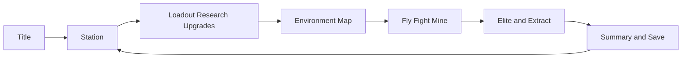
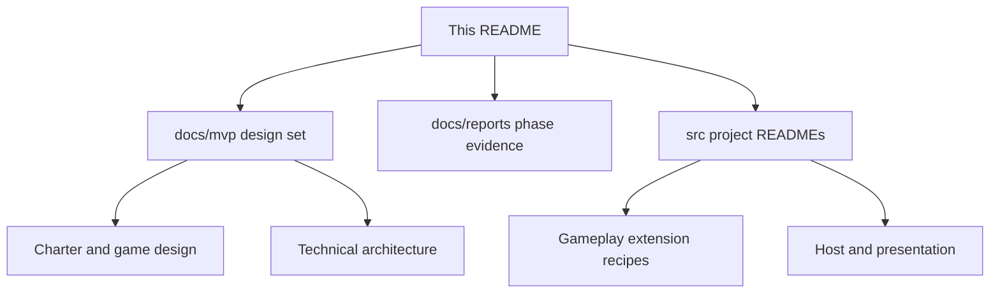
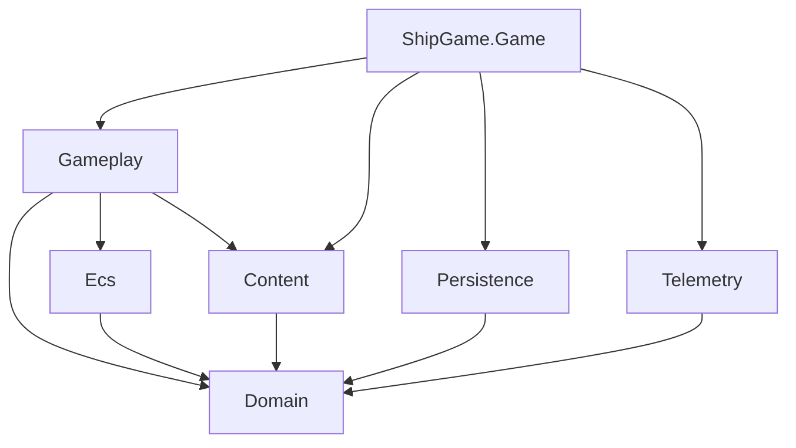

# Ship Game

Ship Game is a Windows desktop MVP about short space expeditions. The player-facing title is **Mine Your Own Business**. You fly the Wayfarer Mk I, fight and mine in a seeded field, extract what you can, then spend banked resources on permanent research and station upgrades between runs. The goal of this slice is to learn whether that loop stays fun under low attention, not to ship a universe simulator.

The stack is .NET 9 with MonoGame 3.8.5 DesktopVK. Authoritative gameplay lives in headless Gameplay code. The Game project only hosts input, rendering, audio, and composition. Content is validated and built through a C# content pipeline rather than a hand maintained MGCB source of truth.



## Current status

The vertical slice through P5 integration is playable end to end: new or continue profile, Station and loadout, environment select, composed flight combat and mining, elite and extraction, rewards, research, station upgrades, and local save. Automated tests across architecture, gameplay, content, persistence, telemetry, and smoke paths are green on a normal full suite run.

What remains for Round A confidence is mostly evidence and polish rather than missing core systems. A full 1080p performance capture and the longer multi run reliability marathon are still outstanding. Art and the procedural pixel font are provisional. Music is intentionally a brief only. Known gaps and waivers live under the P5 integration reports.

In other words, the durable base is in place and ready for playtesting and iteration. It is not claiming finished production content.

## Where to read next

Product intent and MVP boundaries start in [docs/mvp/README.md](docs/mvp/README.md). That map points to the charter, game design, content catalog, systems, technical architecture, evolution strategy, art direction, agent workflow, and validation backlog. Long term product ambition beyond the MVP sits in [docs/requirement.md](docs/requirement.md).

Phase delivery evidence lives under [docs/reports/](docs/reports/), with P0 through P5 packages and the integration gates. Those reports are archival snapshots and may describe superseded loops. For day to day code changes, use the project guides next to the source: [Gameplay](src/ShipGame.Gameplay/README.md) for weapons, enemies, movement, research, upgrades, and world run side effects; [Game](src/ShipGame.Game/README.md) for screens, input, and presentation; then [Domain](src/ShipGame.Domain/README.md), [Ecs](src/ShipGame.Ecs/README.md), [Content](src/ShipGame.Content/README.md), [Persistence](src/ShipGame.Persistence/README.md), and [Telemetry](src/ShipGame.Telemetry/README.md).



When documents disagree, prefer the source of truth order in the MVP docs README. Design docs define behavior and must match the current code. Project READMEs explain how the code is organized and extended.

## Repository shape

`src/` holds the layered projects. `tests/` mirrors them with architecture policy, unit coverage, and smoke checks. `content/` holds source art, definitions, and generated outputs. `tools/ShipGame.ContentBuilder` packs content. `scripts/` wraps restore, content build, compile, test, and launch. `docs/` holds design truth and delivery reports.



MonoGame stays inside Game. Gameplay must remain deterministic and testable without a window.

## Building and running

From the repo root on Windows, `scripts/build.ps1` restores, builds content, and compiles Release. `scripts/test.ps1` runs the suite. `scripts/launch.ps1` starts the DesktopVK host. For a quick automated window path, the smoke entry used by tests remains available through the host harness described in the Game guide and P5 playtest notes.

A practical first session after a successful build: create a new profile, visit Station, open Map, launch Cinder Belt, fly with WASD or stick, fire and mine, extract or fail, then buy research or station upgrades with banked materials and continue from disk.

## Sharing a playtest build

To package a standalone Windows build your friends can run without installing .NET:

```powershell
./scripts/publish.ps1
```

That writes a self-contained folder to `artifacts/publish/win-x64/` and a zip at `artifacts/ShipGame-win-x64.zip`. Share the zip; they unzip and double-click `ShipGame.exe`. Needs 64-bit Windows and a Vulkan-capable GPU.

## How we expect the code to grow

Prefer closed registries, validated content IDs, and focused systems over plugin frameworks or speculative engines. Adding a weapon or enemy means a behavior enum, a strategy class, registry registration, and a deterministic test. Changing ship movement usually means flight statistics or mobility resolution in Gameplay, not host side hacks. The evolution strategy document spells out the longer deferred map. Keep permanent progress versioned and recoverable whenever save meaning changes.
