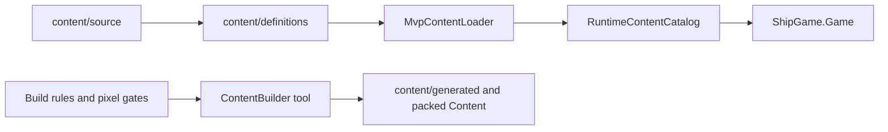

# ShipGame.Content

This project owns content contracts, validation, atlas metadata, and the MVP catalog loader. It depends only on Domain. It never runs gameplay or touches MonoGame runtime APIs. The Content Builder tool consumes these contracts when packing assets.

Namespaces stay flat (`ShipGame.Content`). Folders group assets, atlas shapes, build rules, and validation.

`Assets/` covers manifests and runtime catalogs. `Atlas/` describes sprite regions and collision shapes. `Build/` holds packaging rules and art gates. `Validation/` rejects duplicate or missing IDs before anything reaches the host.

## How content reaches the game

Authoring lives under the repo `content/` tree. Definitions and manifests are validated, then the builder produces loadable assets. At runtime, Game loads the catalog and binds presentation IDs to textures and cues. Simulation should keep using stable content IDs and behavior keys, not file paths or MonoGame types.

## Changing art without changing gameplay

Swap or redraw atlas regions and update the matching definition or region metadata. As long as the stable ID stays the same, combat and world logic do not need to change. If a new gameplay concept needs a new ID, add the definition and validation coverage first, then point presentation at it.

## Adding or tightening gates

Pixel and build gates live under `Build/`. Use them to protect palette, silhouette, or packaging invariants. Prefer failing the content build with a clear validation issue over letting bad assets reach playtests silently.
