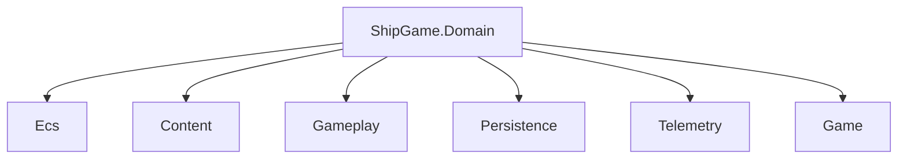

# ShipGame.Domain

Domain is the innermost ring. It holds stable IDs, version constants, profile resource types, and the owned PRNG. It depends on nothing in the solution except the .NET base libraries. Every other project may read these types. Nothing here may know about ECS worlds, MonoGame, files, or UI.

`ContentId.cs` and `ContractVersions.cs` stay at the project root because nearly everything touches them. `Meta/` holds profile snapshots, resources, loadouts, rewards, settings, and meta telemetry facts. `Rng/` holds PCG32, named streams, and stable hashing.

## Working with IDs and versions

Content and capability identifiers are ordinary strings wrapped as `ContentId` or catalog constants such as those in `MetaContentIds`. Keep them stable once shipped. When a persisted meaning changes, bump the relevant `ContractVersions` field and plan a persistence migration in the Persistence project.

## Randomness

Authoritative randomness goes through `RandomStreams` and named `RngStream` values (layout, encounter, AI, loot, upgrade, cosmetic). Derive streams from the run seed with `StableHash` so a loot roll cannot disturb layout. Never use `System.Random` or wall-clock time in gameplay code that must replay.

## Profile shapes

Resource amounts, lifetime counters, loadout selection, reward proposals, and mutation results live here so Gameplay, Persistence, and Game share one vocabulary. Prefer extending these records carefully and versioning saves when meaning changes.
