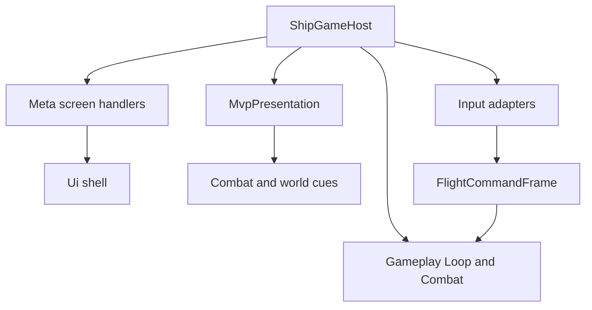

# ShipGame.Game

This project is the MonoGame composition root. It opens the window, loads content, reads device input, drives the fixed gameplay step, and paints the virtual 640 by 360 frame. Gameplay stays the authority. Game translates player intent into commands and gameplay events into pictures and cues.

Namespaces stay flat (`ShipGame.Game`). Folders are only for finding things.

`ShipGameHost` owns the session, the optional composed run, the accumulator for 60 Hz ticks, and wiring. `MvpPresentation` owns textures, the pixel font, and drawing through an `IMetaScreenCanvas`. Meta screens live under `Meta/Screens/` as real handler types. Input adapters live under `Input/`. Shared chrome and view models live under `Ui/`. Cue bindings live under `Presentation/`.

## Adding or changing a meta screen

Each `MetaScreen` value maps to one `IMetaScreenHandler` registered in `MetaScreenHandlerRegistry`. The handler owns UI construction, drawing, hotkeys, and window-smoke navigation for that screen. Prefer putting new lobby or station behavior in a screen class rather than growing `ShipGameHost`.

When you add a screen, introduce the enum value, create a handler under `Meta/Screens/`, register it in the registry so every screen remains covered, and keep session mutations on `MetaSession` or `MetaUiController` so save and telemetry stay centralized.

## Connecting input to the ship

Keyboard and gamepad adapters produce quantized `FlightCommandFrame` values. Those frames are the only player influence on combat. If control feel feels wrong, start in `Input/` and confirm the quantization and action flags, then follow the frame into `FlightCombatWorld.Queue`. Do not apply thrust or aiming directly in the host update loop.

## Presentation without owning truth

Combat and world systems publish events and snapshots. Presentation bindings turn those into cues and sprites. When you change art, update atlas regions and cue maps here. When you change whether something happened, change Gameplay. That split keeps replays and headless tests honest.

## Smoke and harnesses

`SmokeRunner` and the window-smoke path on the host exist for automated and manual launch checks. Screen handlers participate in smoke navigation so the harness does not need a second private switch over `MetaScreen`. Keep smoke behavior boring and deterministic.
