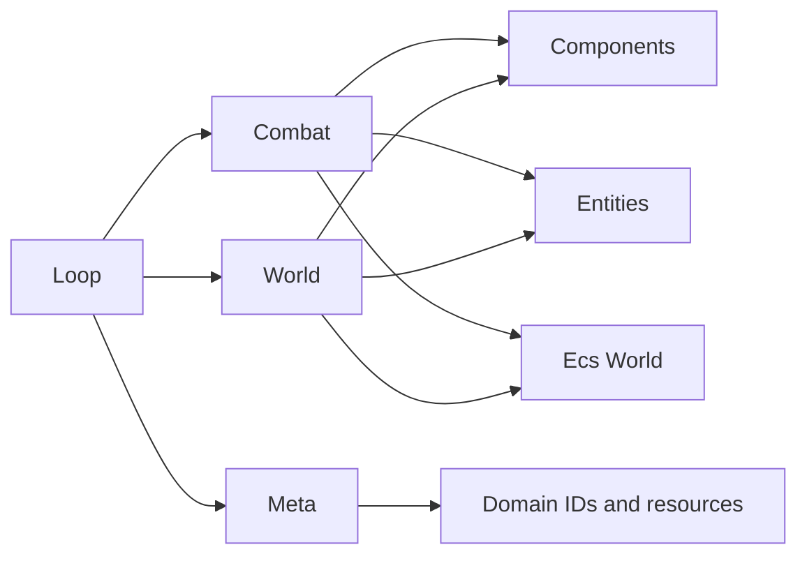
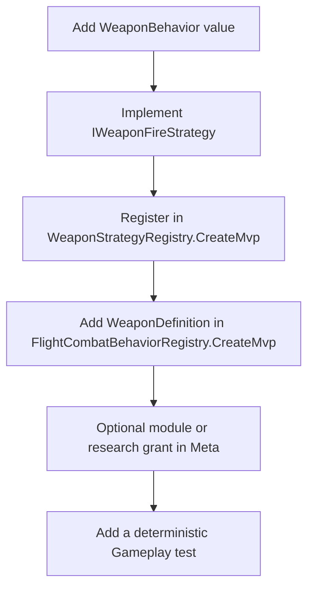
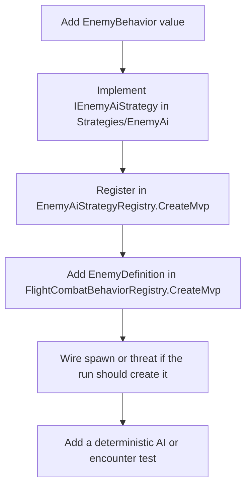

# ShipGame.Gameplay

This project is the authoritative gameplay brain. It owns flight combat, world runs, meta progression catalogs, and the composed loop that stitches those pieces into one expedition. It depends on Domain, Ecs, and Content contracts. It must never reference MonoGame or draw anything.

Namespaces stay flat (`ShipGame.Gameplay`) even though the folders group related types. Treat folders as a map of the codebase, not as a second namespace system.

`Systems/` holds every gameplay `ISystem`. `Components/` holds ECS component structs. `Entities/` holds spawn constructors that attach component bundles. `Contexts/` holds shared runtime state such as `FlightCombatContext`. `Strategies/EnemyAi/` and `Strategies/WeaponFire/` each group the interface, implementations, action surface, and registry for that closed strategy family. `Combat/` keeps the flight world facade, enums, DTOs, math, constants, and definition catalogs (`FlightCombatBehaviorRegistry`). `World/` holds generation, run phases, and fact/event handlers. `Meta/` holds research, modules, loadouts, and run upgrades. `Loop/` holds the fixed-step shell and composed orchestrator.

## Schedule names as contract

`FoundationSession` and `FlightCombatWorld` expose `Schedule` as the ordered list of `ISystem.Name` values registered for `Step()`. Architecture and gameplay tests bind those strings; changing order or names is a breaking contract change.

Foundation (4 phases): `ConsumeCommands`, `SessionTransitions`, `RunClock`, `PublishAndHash`.

Flight combat (13 phases): `ApplyFlightCombatStructuralChanges`, `ConsumeFlightCommands`, `AdvanceCombatTimers`, `ConsumeTemporaryModifiers`, `AiAndThreatDecisions`, `ResolveMobility`, `IntegrateFlightMovement`, `RebuildCombatSpatialIndex`, `DetectCombatCollisions`, `ResolveWeapons`, `ResolveMines`, `ResolveOrderedDamage`, `PublishCombatEventsAndHash`.

Each combat phase is an `ISystem` in `Systems/` that owns its update logic; `FlightCombatContext` holds the shared world, buffers, registries, and spawn/damage helpers. Entity constructors in `Entities/` centralize which components each spawn archetype receives; combat and world facades call them after `CreateEntity`. Combat iteration rebuilds a sorted live entity census from the `Transform2` store each phase; spatial collision uses a tick-local dense remap (`SpatialEntities`). Destroy sync is `PendingDestroy` applied in `ApplyFlightCombatStructuralChanges`, not `CommandBuffer`.

## Adding a weapon

Weapons are closed strategies keyed by `WeaponBehavior`, not open plugins. A new fire mode means a new enum value, a strategy class that owns the fire logic, and registration in two factories.

1. Add a value to `WeaponBehavior`.
2. Create an `IWeaponFireStrategy` under `Strategies/WeaponFire/` that sets `Behavior` and implements fire resolution. Use the narrow `WeaponFireActions` surface for damage, events, and projectile spawns. If the weapon needs homing or special projectile setup, put that intent on `PlayerProjectileSpawnRequest` from the strategy rather than branching inside `FlightCombatWorld`.
3. Register the strategy in `WeaponStrategyRegistry.CreateMvp()` (same folder). The registry requires every enum value to have exactly one strategy.
4. Add a `WeaponDefinition` in `FlightCombatBehaviorRegistry.CreateMvp()` with damage, cadence, range, and any burst or lock parameters.
5. If players should unlock it, grant the module through research or loadout catalog entries in `Meta/`, using semantic module IDs rather than hard-coding research IDs inside combat systems.
6. Cover the new behavior with a deterministic test so identical seeds and commands still hash the same way.

## Adding an enemy

Enemies follow the same closed-registry pattern through `EnemyBehavior` and `IEnemyAiStrategy`.

The strategy receives movement and attack decisions through `EnemyAiCombatActions` (projectiles, mines, and similar). Keep the branched personality in the strategy class under `Strategies/EnemyAi/`. `FlightCombatWorld` should only look up the strategy and call it.

If the enemy appears during a run through threat or elite flow, update the spawn path in the combat sim or the composed orchestrator host methods used by world event handlers. Do not reach into presentation from here.

## Changing ship movement or mobility

Ordinary flight feel lives on `FlightStatistics` (acceleration, braking, max speed) and the `IntegrateFlightMovement` system. Player and AI intents become motion through `ControlIntent` and velocity integration. Tuning the Wayfarer’s cruise behavior usually means adjusting those statistics or the integrate/braking math, then proving the change with a deterministic test.

Burst mobility is separate. `MobilityBehavior` today is dash versus blink, resolved in `ResolveMobilitySystem`. That is still a small if-chain on purpose. Introduce an `IMobilityStrategy` registry only when a third distinct mobility personality shows up and the branching starts to hurt readability. Until then, prefer editing the existing mobility resolution and the `MobilityAbility` component values granted by engine modules.

## Adding research, modules, or run upgrades

Meta content lives under `Meta/` as C# catalogs for the MVP. Research nodes grant modules or semantic capabilities. Modules feed loadout resolution and derived ship statistics. Run upgrades are temporary offers applied during a run and cleared when the expedition ends.

When you add a node or upgrade, define it in the matching catalog file and grant something systems already understand: a module ID, a stat modifier, or a capability such as travel access. Gameplay code should query capabilities and resolved statistics, never a specific research ID. If a grant needs new combat behavior, add that behavior through the weapon or AI registries first, then point the catalog at it.

## Adding a world-run fact or event side effect

World progression speaks in facts (what happened) and events (what the run sim requests next). Side effects that touch combat or mining go through closed handlers under `World/`.

For a new event kind, add the enum value, implement `IWorldRunEventHandler`, and register it in `WorldRunEventHandlerRegistry` for every kind (use a no-op handler when the kind is presentation-only). Handlers talk to a narrow `IWorldRunEventHost` so they never need the whole orchestrator. For a new fact kind, implement `IRunFactHandler` and register it exhaustively the same way. Keep accounting idempotent on `FactId`.

## How to explore from here

Start in `Loop/ComposedRunOrchestrator.cs` to see one tick of a full run. Follow combat ticks into `Combat/FlightCombatWorld.cs`, run phase logic into `World/WorldRun.cs`, and unlock tables into `Meta/`. Extension almost always means a new registry entry beside an existing strategy or catalog row, not a new service locator or inheritance tree.
