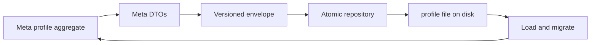

# ShipGame.Persistence

Persistence owns versioned save envelopes, migration registration, and atomic profile repositories. It depends on Domain and Content contracts. It does not run gameplay ticks and never references MonoGame.

`Save/` holds the generic envelope, compatibility status, migration registry, and foundation repository patterns. `Meta/` holds the meta profile schema, DTOs (including banked resources, research, `PurchasedUpgradeIds`, loadout, and counters), and `MetaSaveRepository` used by the Station continue path.

## Changing what gets saved

Each persistent concern contributes explicit DTOs. Raw ECS stores are never written to disk. When you add a field that players must keep between sessions, extend the meta DTO set, bump the meta save schema when meaning changes, and register a migration before releasing that build.

## Compatibility and recovery

Loads should classify compatibility clearly and recover from torn writes where the repository already supports atomic replace. Prefer failing with a precise status over silently rewriting an incompatible profile. Tests in the Persistence test project are the gate for round trips, corruption recovery, and unsupported versions.

## How Game uses this

`MetaSession` in Game constructs the repository against a save directory and asks it to load or store profile snapshots. Keep file paths and MonoGame concerns out of this project. Persistence speaks DTOs and versions, not screens.
