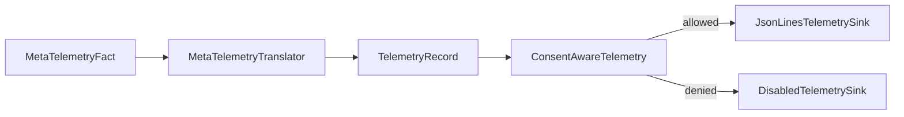

# ShipGame.Telemetry

Telemetry records local, versioned facts about meta play. It depends on Domain. It does not decide gameplay outcomes and must stay easy to disable.

The project stays flat. Records and the `ITelemetrySink` contract sit beside a disabled sink, a JSON lines sink, consent-aware wrapping, and the meta fact translator.

## Emitting facts

Game and meta session code create `MetaTelemetryFact` values for screen changes, saves, research purchases, and similar moments. The translator turns those into sink records. Prefer adding a fact kind and translation path over logging free-form strings from deep gameplay code.

## Consent and sinks

Respect telemetry consent before writing. The consent-aware wrapper chooses a real sink or the disabled sink. Local JSON lines output is enough for the MVP. Do not introduce network exporters unless product requirements say so.

## Keeping it honest

Telemetry must not feed back into gameplay decisions. If a metric seems to require changing combat balance at runtime, that logic belongs in Gameplay design and tests, not in the sink.
